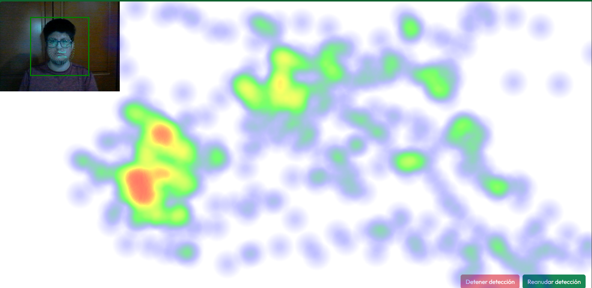

# Laboratorio 10. Eye-tracking con Webgazer
## Nombre: Eduardo Loza
## Url: https://n1c0145.github.io/Portafolio-IPC2/
## ¿Qué hace el proyecto?

El proyecto correspondiente al Laboratorio 10 utiliza la librería **WebGazer.js** para realizar seguimiento del movimiento de los ojos en tiempo real. Captura los puntos donde el usuario está mirando y al detener la detección, genera un **mapa de calor** visual con **Heatmap.js** que muestra las zonas más observadas en la pantalla.

## ¿Cómo ejecutarlo?

Se debe abrir la página en un navegador moderno y aceptar el permiso para usar la cámara cuando el navegador lo solicite. 

Se sugierer para obtener mejores resultados:

- Tener una cámara con buena calidad.
- Tener buena iluminación frente a la cámara.
- Colocar la cámara de forma que el rostro quede visible y centrado.

La detección de mirada comenzará automáticamente. 

- El botón **"Detener detección"** pausa la detección de mirada y muestra el mapa de calor con los puntos acumulados.  
- El botón **"Reanudar detección"** reanuda la detección y empieza una nueva captura.
- En la **consola del navegador** se imprimen las coordenadas X, Y de la mirada en tiempo real.

## Librerías utilizadas

- [WebGazer.js](https://webgazer.cs.brown.edu/) — Para el seguimiento ocular en tiempo real.
- [Heatmap.js](https://www.patrick-wied.at/static/heatmapjs/) — Para la generación visual del mapa de calor.
- [Bootstrap 5](https://getbootstrap.com/) — Para el diseño responsivo y componentes UI.
- [Font Awesome](https://fontawesome.com/) — Para los íconos.
- Google Fonts (Outfit) — Para tipografía personalizada.

## Captura de pantalla del mapa de calor generado

# Laboratorio 8 - Interacción Persona Computador
## Nombre: Eduardo Loza
## Figma: https://www.figma.com/design/zrMsqYWeRrkjZ4rzL7GP66/Lab1-IPC?node-id=0-1&t=IFlO5zjYyaq09g0U-1
## Url: https://n1c0145.github.io/Portafolio-IPC2/
## Cumplimiento de Requisitos del Laboratorio:

### 1. Uso correcto de etiquetas semánticas de HTML5
El código utiliza etiquetas semánticas apropiadas como `<nav>` para la navegación principal, `<main>` para el contenido principal y `<footer>` para la información de contacto. 

### 2. Contraste adecuado entre texto y fondo
Se aplicó un contraste adecuado entre colores de texto y fondos, validado con la herramienta WebAIM El contraste fue de 7.25:1, superando el mínimo requerido para nivel AAA (7:1).

### 3. Inclusión de atributos alt descriptivos en imágenes
Todas las imágenes incluyen atributos `alt` descriptivos, proporcionando información alternativa para usuarios de lectores de pantalla. Por ejemplo, la foto de perfil tiene `alt="Foto Perfil"` y los logos de proyectos tienen descripciones específicas.

### 4. Navegación con teclado funcional (tabulador)
Se verificó que la navegación con teclado funcione correctamente en todos los enlaces y botones del sitio, incluyendo los elementos del menú de navegación y botones “Ver más” o “Descargar Curriculum”. 

### 5. Definición explícita de jerarquía en títulos (`h1`, `h2`, `h3`, etc.)
La estructura de encabezados está bien definida y jerarquizada. El título principal usa `<h1>`, seguido de subtítulos `<h2>` y descripciones con `<h3>`, facilitando la comprensión y navegación por el contenido.

### 6. Descripción clara en enlaces y botones
Los textos de los enlaces y botones son claros y descriptivos, evitando frases ambiguas.

### 7. Criterios de legibilidad y comprensión del contenido textual
Se seleccionó una tipografía legible (‘Outfit’) y tamaños de fuente adecuados para mejorar la lectura. Además, se utiliza un lenguaje claro y directo en las descripciones, evitando tecnicismos innecesarios.

## Verificación técnica y visual

- Se utilizó la herramienta WebAIM Contrast Checker para validar el contraste de colores.
- Se probó la navegación con teclado y se verificó la visibilidad del foco.
- Se probó que con teclado se pueda subir, bajar, navegar por la página correctamente y acceder a todos los elementos interactivos (menú, botones, enlaces). 

## Cambios realizados respecto al Laboratorio 7 para cumplir WCAG AAA

1. **Foco visible mejorado:**  
   - Se cambió el estilo de foco (`:focus`) para que sea un contorno oscuro bien visible, facilitando la navegación con teclado.

2. **Efecto hover accesible:**  
   - Se añadió una clase CSS para que los botones tengan un crecimiento suave del 10% al pasar el mouse (`hover`), mejorando la señal visual para usuarios con mouse y manteniendo la consistencia.

3. **Uso correcto de atributos `alt` en imágenes:**  
   - Todas las imágenes, incluyendo la foto de perfil y logos de proyectos, tienen textos alternativos descriptivos, mejorando la experiencia de lectores de pantalla.

4. **Implementación de roles y atributos ARIA:**  
   - Se añadieron atributos como `aria-hidden="true"` en iconos decorativos para que sean ignorados por lectores de pantalla.
   - Uso de `aria-label` cuando fue necesario para describir mejor botones o enlaces no textuales.

5. **Etiquetas semánticas mejoradas:**  
   - Se sustituyeron ciertos contenedores por etiquetas semánticas HTML5 adecuadas como `<article>` para secciones independientes (por ejemplo, tarjetas de proyectos).
   - Se mantuvo el uso de `<nav>`, `<main>`, `<footer>` para estructura clara.

6. **Jerarquía clara de encabezados:**  
   - Se confirmó que la estructura de títulos (`h1`, `h2`, `h3`) está jerarquizada y clara, mejorando la navegación por contenido.

7. **Contraste de colores revisado:**  
   - El color primario y el secuadario tienen un contraste 7.25:1, suficiente para nivel AAA.
   - Se revisaron otros colores secundarios con opacidad para garantizar legibilidad.

8. **Navegación con teclado funcional:**  
   - Se garantizó que todos los enlaces y botones del menú y contenido sean accesibles con tabulador, sin perder el foco en ningún elemento.

9. **Legibilidad y comprensión:**  
    - Uso de la fuente ‘Outfit’, tamaños adecuados y colores que facilitan la lectura.
    - Texto escrito en lenguaje claro y directo.

